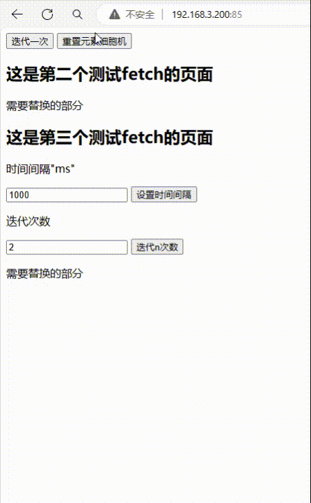

# v0.0.2  
2024年4月3日
- 生命游戏
  1、随机在10*10的方格中生成多个黑点，每次点击能够重新生成

  2、按照“生命游戏”的逻辑，进行一次更迭

  3、选择迭代步数，可以连续迭代多次

  4、可修改3中每次迭代的时间（单位:ms）

- 使用技术
  go（beego服务器框架）

  html（页面绘制）

  js（fetch获取以及显示规则）

  nginx（用户站点的布置）

- 执行 & 准备
  1、linux放开任意端口，用于访问内部的beego服务器，以及提供站点服务

  2、go build

  3、./beego
  
  4、ui登录 ip:port

- 运行截图

# v.0.0.1
- 生命游戏的demo

  
  随机在10*10的方格中生成多个黑点，按照“生命游戏”的逻辑，进行每秒一次的更迭

  
仅实现：
- 每次迭代变化 (golang)
- ui展示（html,js）

待实现：
- 指定部分固定图案，进行展示；(golang)

执行   
- go build
- ./beego
- ui登录 ip:9292（可在main.go中修改）

显示

